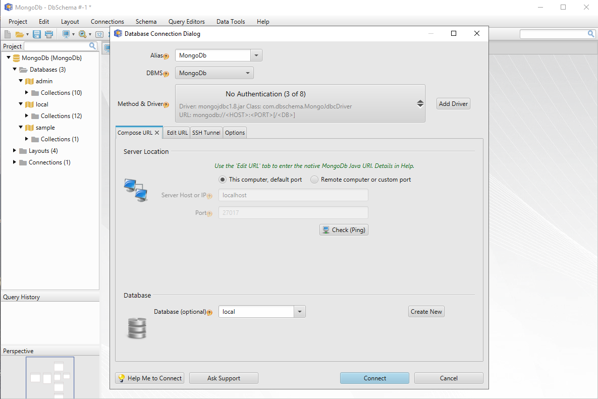
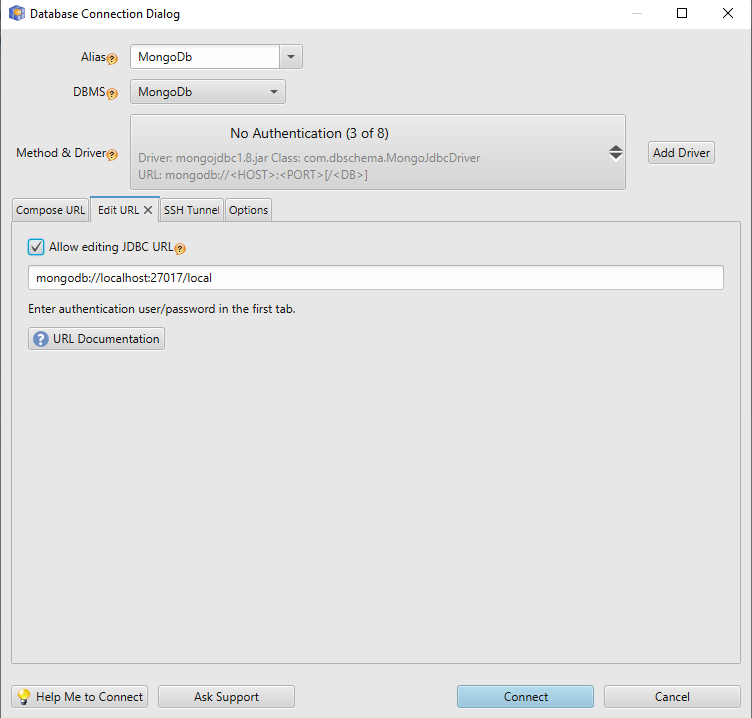
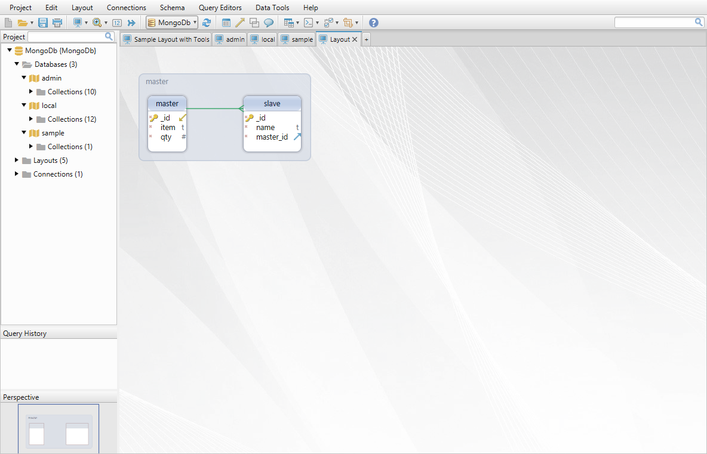
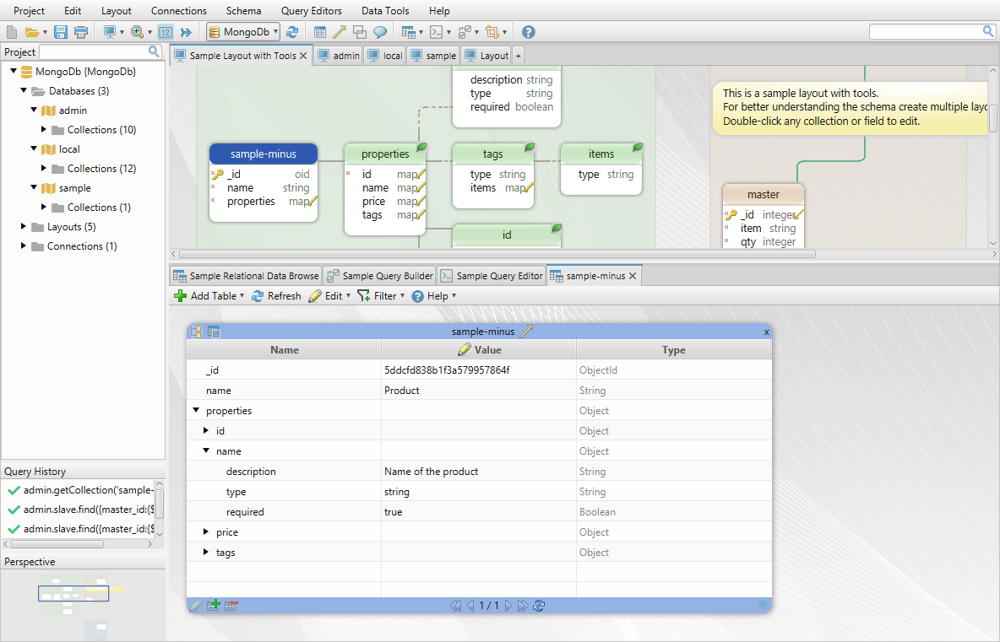

# Open Source MongoDb JDBC Driver

The driver is written by [DbSchema MongoDb GUI Tool](https://dbschema.com) for everybody how needs an MongoDb JDBC driver. 

## Driver Features

* JDBC driver capable to execute native MongoDb queries, similar with Mongo Shell. 

* The driver is using the native [MongoDb Java driver](https://mongodb.github.io/mongo-java-driver/) to connect and execute queries. 
Therefore the JDBC URL is the same as [MongoDb URL](https://mongodb.github.io/mongo-java-driver/3.4/driver/tutorials/connect-to-mongodb/).

* The driver returns by default a ResultSet with a single Object. Use `resultSet.getObject(1)` to get this object.
Adding the parameter `expand=true` in the URL will create a column in the result set for each key in the result document.
If expand is set the driver will read ahead a number of rows in order to create a correct ResultSetMetaData. This is transparent for the user.
This because the first document in the result may have less keys as the next records.

* To be able to execute native MongoDb queries we embedded an Rhino JavaScript engine inside the driver.
 Each time you execute a query we parse and run it as JavaScript with Rhino.


* Calling methods from the DatabaseMetaData.getTables(), getColumns(), etc., the driver will 
deduce a logical structure of the database. We presume that collections are storing similar documents, so we 'deduce' a virtual schema by 
scanning random documents from each collection.
The number of scanned documents can be set in the URL using the parameter scan=<fast|medium|full>.


## License

BSD License-3. Free to use, distribution forbidden. Improvements of the driver accepted only in https://bitbucket.org/dbschema/mongodb-jdbc-driver.

## Download JDBC Driver Binary Distribution

[Available here](http://www.dbschema.com/jdbc-drivers/MongoDbJdbcDriver.zip). Unpack and include all jars in your classpath. The driver is compatible with Java 8.

## Driver URL

```
jdbc:mongodb://[username:password@]host1[:port1][,...hostN[:portN]][/[database][?options]]
```
The driver is using the same URL, options and parameters as [native MongoDb Java driver](https://docs.mongodb.com/manual/reference/connection-string/). 
Different is only the 'jdbc:' prefix.


## How to Use the Driver

The driver can be use similar with any other JDBC driver. The resultSet will always receive a single object as document.
```
#!java

import java.sql.Connection;
import java.sql.PreparedStatement;

...

Class.forName("com.dbschema.MongoJdbcDriver");
Properties properties = new Properties();
properties.put("user", "someuser");
properties.put("password", "somepassword" );
Connection con = DriverManager.getConnection("jdbc:mongodb://host1:9160/keyspace1", properties);
// OTHER URL (SAME AS FOR MONGODB NATIVE DRIVER): mongodb://db1.example.net,db2.example.net:2500/?replicaSet=test&connectTimeoutMS=300000
String query = "db.sampleCollection().find()";
Statement statement = con.createStatement();
ResultSet rs = statement.executeQuery( query );
Object json = rs.getObject(1);

```

Any contributions to this project are welcome.
We are looking forward to improve this and make possible to execute all MongoDb native queries via JDBC.

## How it Works

The driver implements a PreparedStatement where native MongoDb queries can be passed. Sample: `db.myCollection.find()`.
In the MongoPreparedStatement we start a Rhino JavaScript engine, and pass this query to the engine.
The engine receives also an object 'db':new WrappedMongoDatabase().

The WrappedMongoDatabase is a wrapper around the native MongoDatabase object, with support for Collections as native member variables.
This  make possible to do ´db.myCollection´ - otherwise it would work only `db.getCollection('myCollection')`

The collection objects are wrapped as well into WrappedMongoCollection. The reason for this is that most of the methods 
require Bson objects, and JavaScript will generate only Map objects.

For example `db.myCollection.find({'age':12})` will result in a call of db.myCollection.find(Bson bson) with a Map instead of Bson, which will throw an error.
We tried various solutions for avoiding this, including java Proxy. If you know any better solution please let us know, we can improve the project.
Writing the Wrapper class we added methods which receive Map objects and we take care of the conversion.

In test cases we try to add all possible queries we want to support. If you find any query which does not work please feel free to commit in the source code or write us.


## How to Test the Driver

The driver can be tested by simply downloading the [DbSchema Database GUI Tool](https://dbschema.com). The tool can be tested free for 15 days.
 
DbSchema reads sample JSon documents from the database and deduces a 'logical schema' which is shown as diagrams. 
Deducing means we consider that each collection documents have similar structure, so we read a bunch of documents from each collection and deduce the schema.


Connecting to MongoDb is simple. You can choose different methods to connect, the host, port, etc.
The driver is downnloaded automatically by DbSchema from dbschema.com webserver.



The JDBC URL is the same as the native MongoDb Java driver. This can be customized in the second tab.



DbSchema is featuring tools for writing MongoDb queries, in the same way as in the MongoDb Shell:


DbSchema can create **virtual foreign keys** which will be saved to project file.
This are useful in Relational Data Browse, for easy exploring data from multiple tables.



Relational Data Browse is a tool for visually exploring the database data.




A full description of DbSchema features is available on [DbSchema website](https://dbschema.com/mongodb-tool.html).
DbSchema can be [downloaded](https://dbschema.com) and tested for free for 15 days.